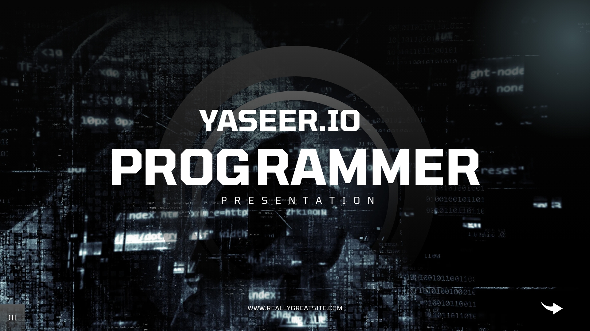

<h1 align="center">🚀 I'm Yaseer Dauda!</h1>
<h3 align="center">💻 Frontend Alchemist | 🎨 UI/UX Enthusiast | 🇳🇬 Coding from Nigeria</h3>

  

  <em>✨ "Excellence is not a skill, it's an attitude!" ✨</em>

  <em>"First, solve the problem. Then, write the code." – John Johnson</em>

---

### 🛠️ Tech Stack

  

---

### 🎯 Quick Glance

  

- 🔥 **Current Obsession:** Building pixel-perfect experiences with React & Vue
- 🚧 **Latest Project:** Crafting [MegaXU](https://github.com/daudagaya/MegaXU) - *"A team that codes together, grows together!"*
- 🛠️ **Seeking Collabs:** Open-source contributors wanted! *"Many hands make light work." – John Heywood*
- ☁️ **DevOps Quest:** Learning CI/CD pipelines - *"It’s not a bug; it’s an undocumented feature!"*
- 📬 **Reach Out:** yaseerdaudagaya10@gmail.com | [Book a Chat](https://calendly.com/daudagaya)
- 🤣 **Fun Fact:** *"I told my computer I needed a break... now it won’t stop sending me Kit-Kat ads!"*

### 📈 GitHub Analytics

  
  

---

### 🌐 Let's Connect

  
  
  

  <em>📫 Want to discuss an epic project? <a href="mailto:yaseerdaudagaya10@gmail.com">Shoot me an email</a> or DM!</em>

---

### 💡 Coding Philosophy
> *"The best error message is the one that never shows up."*  
> *"Clean code always looks like it was written by someone who cares." – Robert C. Martin*

⭐ *Pro Tip: If you like my work, star some repos and watch the magic happen!*
